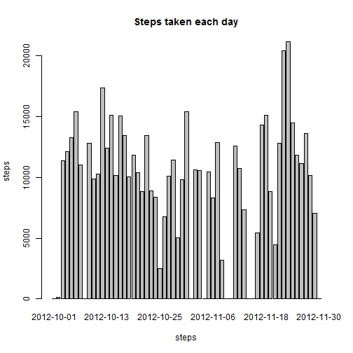
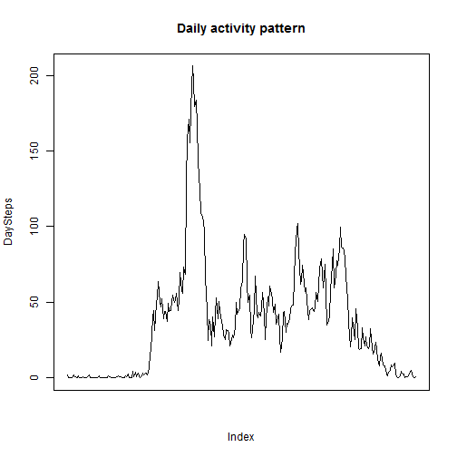
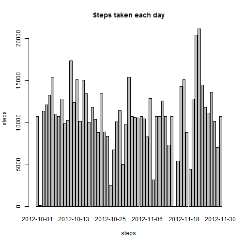
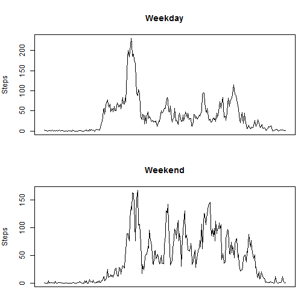

##Loading and preprocessing the data
- Load the data

```r
data<-read.csv("activity.csv",na.strings="NA")
data$date<-as.Date(as.character(data$date))
```

##What is mean total number of steps taken per day?
- Make a histogram of the total number of steps taken each day

```r
TotalSteps<-tapply(data$steps,as.factor(data$date),sum,na.rm=TRUE)
barplot(TotalSteps,xlab="steps",ylab="steps",main="Steps taken each day")
```

 

```r
#If use hist here will generate a plot indicating the frequency distribution
```

- Calculate and report the mean and median of the total number of steps taken per day

```r
mean(TotalSteps)
```

```
## [1] 9354.23
```


```r
median(TotalSteps)
```

```
## [1] 10395
```

##What is the average daily activity pattern?
- Make a time series plot (i.e. type = "l") of the 5-minute interval (x-axis) and the average number of steps taken, averaged across all days (y-axis)

```r
DaySteps<-tapply(data$steps,as.factor(data$interval),mean,na.rm=TRUE)
plot(DaySteps,type="l",main="Daily activity pattern",xaxt="n")
```

 

- Which 5-minute interval, on average across all the days in the dataset, contains the maximum number of steps?

```r
data$interval[as.numeric(which.max(DaySteps))]
```

```
## [1] 835
```

##Imputing missing values
- Calculate and report the total number of missing values in the dataset

```r
sum(is.na(data$steps))
```

```
## [1] 2304
```

- Devise a strategy for filling in all of the missing values in the dataset. The strategy does not need to be sophisticated.
I'm going to use the average of this 5-minute interval to fill the missing values.
The new dataset will be name newdata.

```r
NaPosition<-is.na(data$steps)
MedianValue<-rep(DaySteps,length(unique(data$date)))
newdata<-data
newdata$steps[NaPosition]<-MedianValue[NaPosition]
```

- Make a histogram of the total number of steps taken each day and Calculate and report the mean and median total number of steps taken per day.

```r
NewTotalSteps<-tapply(newdata$steps,as.factor(newdata$date),sum,na.rm=TRUE)
barplot(NewTotalSteps,xlab="steps",ylab="steps",main="Steps taken each day")
```

 

```r
#If use hist here will generate a plot indicating the frequency distribution
```
Obviously, those days without data at first now have been filled.

- Calculate and report the mean and median of the total number of steps taken per day

```r
mean(NewTotalSteps)
```

```
## [1] 10766.19
```


```r
median(NewTotalSteps)
```

```
## [1] 10766.19
```

These values are different from the above result.

##Are there differences in activity patterns between weekdays and weekends?
- Create a new factor variable in the dataset with two levels - "weekday" and "weekend" indicating whether a given date is a weekday or weekend day

```r
newdata$datetype<-rep("weekday",length(newdata$date))
for (i in 1:length(newdata$date)){
      if (weekdays(as.Date(newdata$date[i])) %in% c("Saturday", "Sunday"))
      newdata$datetype[i]<-"weekend"}
```
      
- Make a panel plot containing a time series plot (i.e. type = "l") of the 5-minute interval (x-axis) and the average number of steps taken, averaged across all weekday days or weekend days (y-axis).

```r
par(mfrow = c(2, 1),mar=c(2,4,4,1))
DaySteps<-tapply(newdata[newdata$datetype=="weekday",]$steps,as.factor(newdata[newdata$datetype=="weekday",]$interval),mean,na.rm=TRUE)
plot(DaySteps,type="l",main="Weekday",xlab="",ylab="Steps",xaxt="n")
EndSteps<-tapply(newdata[newdata$datetype=="weekend",]$steps,as.factor(newdata[newdata$datetype=="weekend",]$interval),mean,na.rm=TRUE)
plot(EndSteps,type="l",main="Weekend",xlab="",ylab="Steps",xaxt="n")
```

 
